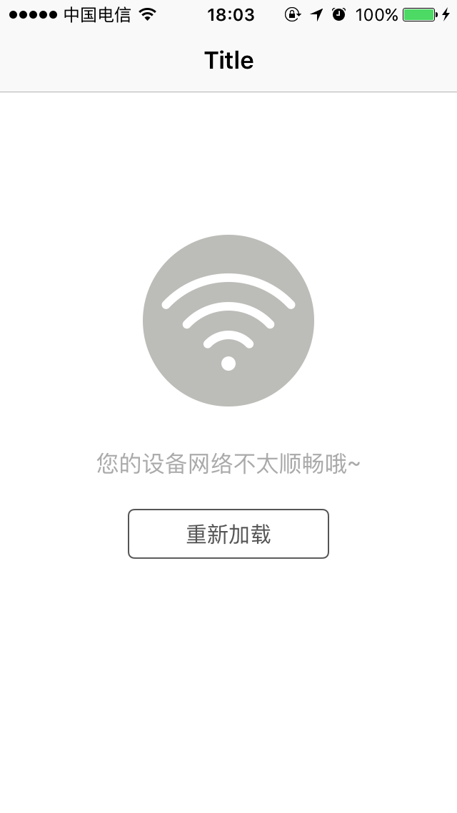

# WLReloadPromptView

一枚弱网络环境下重新加载视图控件, OC 所写, 支持 Swift 和 Storyboard 实时预览.





## 软件要求

- Xcode 7
- iOS 7.0 及以上
- ARC

## 用法示例

```swift
override func viewDidLoad() {
    super.viewDidLoad()
    reloadPromptView = WLReloadPromptView.init(viewController: self)

    // 模拟网络不畅
    DispatchQueue.main.asyncAfter(deadline: DispatchTime.now() + Double(Int64(1 * Double(NSEC_PER_SEC))) / Double(NSEC_PER_SEC)) {
        self.reloadPromptView.appear()
    }

    ...
}

func reloadPromptViewAllowedReload() -> Bool {
    return <#true or false#>
}

func image(in promptView: WLReloadPromptView) -> UIImage {
    return UIImage.init(named: <#image name#>)!
}

func description(in promptView: WLReloadPromptView) -> NSAttributedString {
    let string = NSAttributedString.init(string: "您的网络环境不太顺畅", attributes: [NSFontAttributeName: UIFont.systemFont(ofSize: 16)])
    return string
}

func button(in promptView: WLReloadPromptView) -> UIControl {
    let button = UIButton.init(type: .system)
    ...
    return button
}

func didTapedReloadButton(in reloadView: WLReloadPromptView) {
    ...
}
```


> 具体使用参见仓库中的 Demo.

如果需要在项目中每个 View Controller 中实现此功能，建议重载 UIViewController 并将此控件添加至父类控制器中，或者考虑 Method Swizzing.

## 安装

### CocoaPods

1. 在 Podfile 添加以下代码快速集成。

   ```swift
   platform :ios, '7.0'
   pod 'WLReloadPromptView'
   ```

2. 下载文件手动添加到你的项目中。

